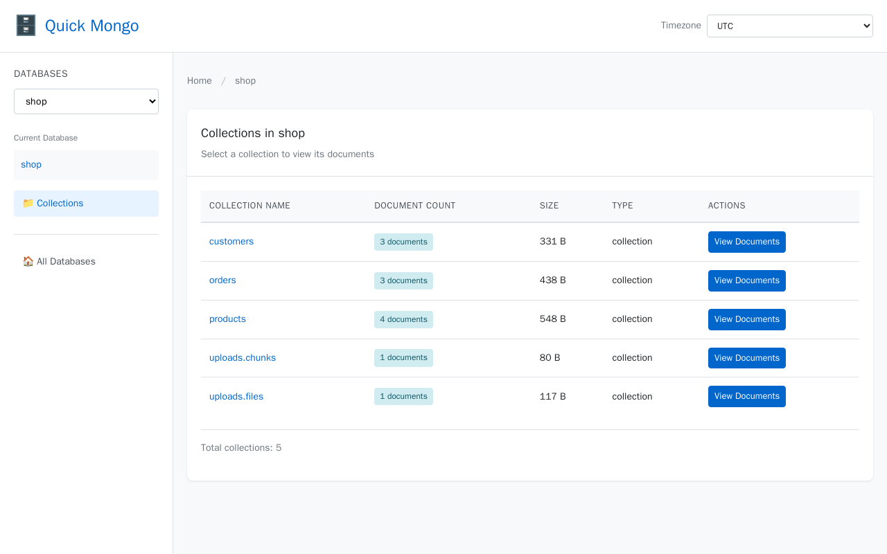
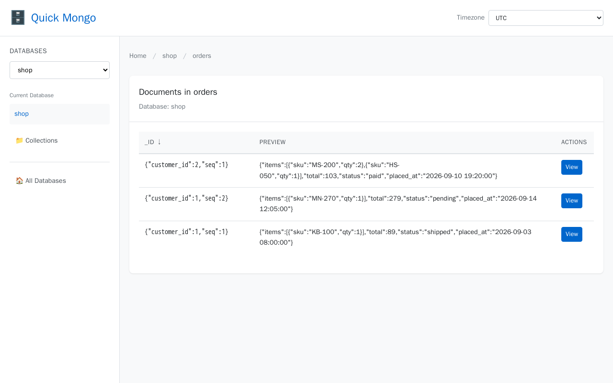
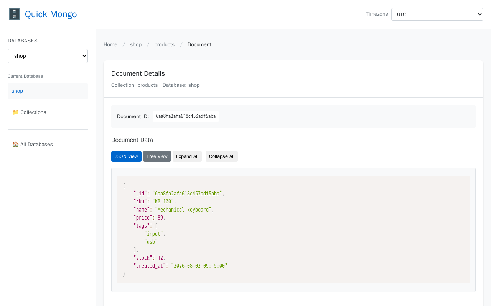

# Quick Mongo

A read-only MongoDB browser in a single PHP folder. No Composer, no build step: run the image next to your Mongo service, or copy the folder into a web root the way you would phpMyAdmin.

## Features

- Lists databases with their size on disk
- Lists collections with document count and data size
- Pages through the documents of any collection, sorted by `_id` ascending or descending
- Shows a document as highlighted JSON or as a collapsible tree
- Downloads files from any GridFS bucket (open a document in a `*.files` collection)
- Shows the GridFS upload time in a timezone picked in the header (defaults to the browser timezone)

## Screenshots

Collections in a database, with document count and size:



Documents in a collection, sorted by `_id`, with a preview of each document. Compound keys are shown as JSON:



A single document as highlighted JSON, with a tree view one click away:



## Run with Docker

This is the usual way to use it. The image `codeboxindia/quick-mongo` is built for `linux/amd64` and `linux/arm64`, and goes in as one more service in your project's `docker-compose.yml`, next to your Mongo service:

```yaml
services:
  mongo:
    image: mongo:7

  quick-mongo:
    image: codeboxindia/quick-mongo
    ports:
      - "8081:80"
    environment:
      MONGO_URI: mongodb://mongo:27017
```

Then open `http://localhost:8081`. `MONGO_URI` points at the Mongo service name on the compose network, and is the only setting most people need. The other is `APP_DEBUG`: `true` shows exception details on error pages, keep it `false` anywhere shared.

For a Mongo running on the host itself:

```
docker run --rm -p 8081:80 -e MONGO_URI=mongodb://host.docker.internal:27017 codeboxindia/quick-mongo
```

On Linux add `--add-host=host.docker.internal:host-gateway` so that hostname resolves.

## Install on a PHP host

Copy the folder into a web root. It never has to sit at the document root and never has to be writable, so a copy at `/tools/quick-mongo/` works as it stands, because every link, asset and form in it is relative.

You need PHP 8.1 or newer with the `mongodb` extension 1.16 or newer (`pecl install mongodb`), a MongoDB server the PHP driver can reach, and one of Apache 2.4 with `mod_rewrite`, nginx with php-fpm, or PHP's built-in server for local use. MongoDB 4.0.5 or newer, because the database list is requested with `authorizedDatabases` so that a user scoped to one database still sees it.

### Configuration, if you need any

Against a MongoDB on localhost with no authentication there is nothing to configure. Otherwise copy `.env.example` to `.env` and set:

- `MONGO_URI`: connection string, default `mongodb://localhost:27017`
- `APP_DEBUG`: `true` shows exception details on error pages, keep it `false` anywhere shared

Real environment variables of the same name win over the file, which is how the Docker image is configured. Under php-fpm they reach PHP only if the pool passes them on, since `clear_env = yes` is the default, so either set them with `env[MONGO_URI] = ...` in the pool config or use `.env` and forget about it.

### Apache 2.4

Copy the folder into the document root or any subdirectory of it, and make sure `.htaccess` is actually read:

```
<Directory /var/www/html>
    AllowOverride All
</Directory>
```

This matters. Debian and Ubuntu ship `AllowOverride None` for the document root, and with that the `.htaccess` in this folder is ignored in full, so there is no routing, no deny rules, and `.env` is downloadable. `mod_rewrite` has to be on (`a2enmod rewrite`). `mod_headers` and `mod_expires` are used when present and skipped when not.

### PHP built-in server

From inside the folder:

```
php -S localhost:8080 router.php
```

`router.php` applies the same deny rules, because the built-in server ignores `.htaccess`.

### nginx with php-fpm

`nginx.conf.example` in this folder is a ready server block: it serves `assets/` from disk, refuses dotfiles and application internals, and sends everything else to `index.php`. Copy it into your nginx configuration, set `server_name`, `root` and `fastcgi_pass`, then reload nginx.

To run it under a subdirectory instead, put the same `location` blocks under that prefix and set `root` so the prefix resolves into the folder.

## What you are looking at

Documents are converted before they are displayed, which buys readability at the cost of some precision. ObjectId, `Decimal128`, `Int64`, `Timestamp` and regular expressions all arrive as strings and binary fields as base64, so a 24 character hex string and a real ObjectId look identical on the page. Dates are converted to UTC and rendered as `Y-m-d H:i:s`. Embedded documents and arrays keep their shapes, so `{}` and `[]` stay distinguishable.

That conversion is why the timezone picker in the header reaches only one value, the GridFS upload time, which is the single timestamp the app formats for itself. Dates inside a document are already UTC text by the time the page is built.

Links to a single document carry the `_id` as canonical extended JSON, which is why they look like `?action=document&db=shop&collection=orders&id={"_id":{"$oid":"..."}}`. Nothing else survives every id type: ObjectId, integers, strings, binary and compound keys all round trip exactly. Typing an id by hand works as well. A 24 character hex string is read as an ObjectId and anything else as a plain string, so a numeric `_id` needs the full form, `id={"_id":42}`.

## Security and deployment

- **Read-only by design**: The application issues only list, find, count and collStats commands. There is no write, update, delete or command execution path.
- **Strict input validation**: Actions are whitelisted; database and collection names are validated before reaching the driver; document lookups enforce literal equality (`$eq`) and reject query operators.
- **Output escaping**: Every value from the database and the query string is HTML-escaped on output.
- **Stateless**: Quick Mongo creates no server-side sessions and sets no cookies, avoiding session locking and session-exhaustion vectors.
- **No built-in authentication**: Quick Mongo contains no login mechanism. **Never expose this tool directly to the public internet.** Place it behind an authentication layer (HTTP Basic Auth, an authenticating reverse proxy like OAuth2-Proxy or Cloudflare Access, a VPN, or an SSH tunnel).
- **Least-privilege credentials**: Use a MongoDB user with read-only permissions (`read` or `readAnyDatabase` roles) rather than administrative credentials.

jQuery and Prism load from public CDNs, pinned to exact versions with subresource integrity hashes, so a modified file is refused rather than run. Every other asset is local. Somewhere with no route to those CDNs the page still renders and every value is readable, but the parts built on jQuery stop working: the database selector, the tree view toggles and the timezone control.

## License

Apache License 2.0. See `LICENSE`.
